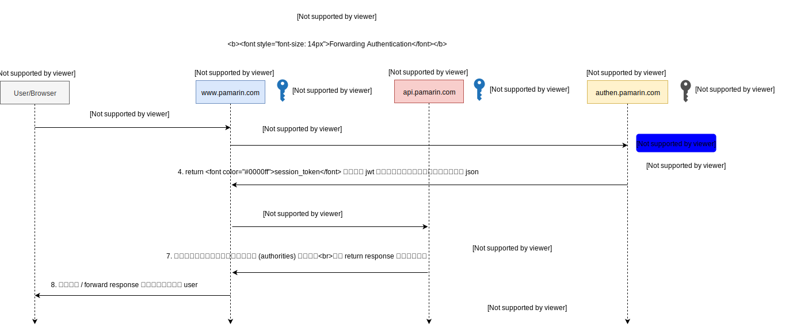

# การเข้าสู่ระบบ (Authentication)


[www.pamarin.com](https://www.pamarin.com) ใช้วิธีการ Authen ด้วย OAuth 2.0 ซึ่งเป็น Standard Authorization Framework ตามข้อกำหนด RFC6749 ที่ทาง IETF (Internet Engineering Task Force) สร้างขึ้นในปี 2012 มีระบบดัง ๆ อย่าง Google, Facebook, Twitter, Youtube etc. ใช้ ทำให้ระบบต่าง ๆ สามารถเชื่อมต่อเข้ามายัง Pamarin เพื่อขอใช้งาน Resources หรือ APIs ต่าง ๆ ที่ทาง Pamarin ได้เตรียมไว้ให้ได้ โดยการปฏิบัติตามข้อกำหนดต่าง ๆ ตามเอกสารฉบับนี้  

*** หมายเหตุ : ทาง Pamarin ได้มีการปรับแต่ง OAuth เพิ่มเติมเพื่อให้รองรับและเหมาะสมกับธุรกรรมต่าง ๆ ของ Pamarin มากขึ้น 

# Version

> 1.0   

# อ้างอิง 
- [RFC 6749 - The OAuth 2.0 Authorization Framework](https://tools.ietf.org/html/rfc6749)
- [https://oauth.net/2/](https://oauth.net/2/)  
- [https://www.oauth.com/](https://www.oauth.com/)  

# บทความ
- [แนวทางปฏิบัติที่ดี ในการทำ OAuth 2.0 Access Token & Refresh Token เพื่อความปลอดภัย](https://medium.com/@jittagornp/best-practice-%E0%B9%83%E0%B8%99%E0%B8%81%E0%B8%B2%E0%B8%A3%E0%B8%97%E0%B8%B3-oauth2-access-token-refresh-token-457ae3bee4b7)
- [[บันทึกส่วนตัว] : การออกแบบ ระบบ authentication ของ micro service](https://medium.com/@jittagornp/%E0%B8%9A%E0%B8%B1%E0%B8%99%E0%B8%97%E0%B8%B6%E0%B8%81%E0%B8%AA%E0%B9%88%E0%B8%A7%E0%B8%99%E0%B8%95%E0%B8%B1%E0%B8%A7-%E0%B8%81%E0%B8%B2%E0%B8%A3%E0%B8%AD%E0%B8%AD%E0%B8%81%E0%B9%81%E0%B8%9A%E0%B8%9A-%E0%B8%A3%E0%B8%B0%E0%B8%9A%E0%B8%9A-authentication-%E0%B8%82%E0%B8%AD%E0%B8%87-micro-service-c08bfea025ef)

# Pre-require

- ทุก ๆ Client / Resource Server จะต้องลงทะเบียน Application เพื่อขอรับ `client_id` และ `client_secret` ก่อน 
- ทุก ๆ Client / Resource Server จะต้อง Download Public Key มาไว้ เพื่อใช้สำหรับ Verify `session_token` ที่ Authorization Server sign มาให้   

# Token
การใช้งาน APIs ต่าง ๆ ของ Pamarin จะประกอบด้วย token 3 ประเภท ได้แก่  
- `session_token` เป็น token ที่ใช้แทนข้อมูล login session ของ user เป็นแบบ stateless ใช้ jwt (Json Web Token) ซึ่ง Authorization Server จะ sign ด้วย private key มาให้ ข้อมูลต่าง ๆ ของ user เช่น ชื่อ, สิทธิ์ (authorities), ข้อมูล client ที่ทำการ login จะเก็บไว้ใน token นี้ มีอายุ 1 นาที เมื่อ Client หรือ Resource Server ได้รับ token นี้ไป จะต้อง verify token ด้วย public key เพื่อเช็คว่า token นี้ยังคง valid อยู่ จึงจะสามารถนำ token ไปใช้งานต่อได้ 
- `access_token` เป็น token แบบ stateful คือ มีการเก็บข้อมูล token ไว้ที่ Authorization Server ใช้สำหรับขอเข้าถึง Resources หรือ Apis ต่าง ๆ ของระบบ มีอายุ 30 นาที 
- `refresh_token` เป็น token แบบ stateful เหมือน `access_token` คือ มีการเก็บข้อมูล token ไว้ที่ Authorization Server เช่นเดียวกัน ใช้สำหรับขอ `access_token` ใหม่ กรณีที่ `access_token` หมดอายุ (expired) มีอายุ 3 วัน   

# Endpoint

> https://authen.pamarin.com

- `/oauth/authorize`
   - `response_type=code` - สำหรับ Grant Authorize และขอ Authorization Code 
- `/oauth/token`
   - `grant_type=authorization_code` - สำหรับขอ Access Token จาก Authorization Code  
   - `grant_type=refresh_token` - สำหรับขอ Access Token จาก Refresh Token  
- `/oauth/session` - สำหรับ Validate Access Token และ Get ข้อมูล User Session 
- `/oauth/signout` - สำหรับ Signout หรือ Logout ออกจากระบบ  

# Flow
- [Authorization Code](#authorization-code)
- [Forwarding Authentication](#forwarding-authentication)
- [Signout](#signout)

# Authorization Code

ใช้สำหรับการ Grant Authorize หรือ Signin เข้าสู่ระบบ ผ่าน Web Browser  
   


# Step

### Step 1) - User / Browser     
พยายามเข้าใช้งาน หรือ ร้องขอ Resource จาก `www.pamarin.com` (Client / Resource Server) ผ่านทาง browser      
โดย browser จะแนบ http cookie : `access_token` / `refresh_token` ไปพร้อมกับ request  
  
### Step 2) - Client / Resource Server  
จะนำ `access_token` มา build http post   
ส่งไปตรวจสอบที่ Authorization Server `/oauth/session`  
  
Http Request headers  
```
Request Method : POST
Content-Type : application/x-www-form-urlencoded
Authorization : Bearer $ACCESS_TOKEN  
```
*** หมายเหตุ : ถ้าไม่มี `access_token` ส่งมาจาก browser จะกระโดดไปทำข้อ 5 เลย 

### Step 3) - Authorization Server : `/oauth/session`  
จะทำการ verify `access_token` และ `user_session` 
ที่เก็บไว้ใน data store (redis) ว่ายัง valid อยู่หรือไม่   

### Step 4.1) - Authorization Server
ถ้า `access_token` และ `user_session` ยัง valid อยู่    
จะ return `session_token` เป็น jwt กลับมาให้ในรูปแบบ json
  
Http Response Body    
```json
{
    "session_token" : "eyJ0eXAiOiJKV1QiLCJhbGciOiJSUzI1NiJ9.eyJzZXNzaW9uLnVzZXIuaWQiO.."     
} 
```

### Step 4.1.1) - Client / Resource Server
ทำการ verify `session_token` ด้วย public key จากนั้นเช็คสิทธิ์ (authorities) ตามข้อมูล 
`session_token` ที่ระบบ authen (Authorization Server) ส่งมาให้  
   
*** ถ้า verify `session_token` ด้วย public key สำเร็จ จะได้หน้าตา session เป็นดังนี้ 
```json
{
    "id": "df1434aa-7b81-481f-9efa-e85eb39448cd", 
    "issuedAt": 1565197615855, 
    "expiresAt": 1565199415855,
    "user": {
        "id": "5cff55864ca1bc12305164ba", 
	"name": "Mr. User Test",
	"authorities": [
	    "ADMIN"
	]
    },
    "client": {
        "id": "b98e21b4-ce2a-11e7-abc4-cec278b6b50a",
	"name": "OAuth2 Test Application",
	"scopes": [
	    "user:public_profile"
	]
    }
}
```

### Step 4.1.1.1) - Client / Resource Server
ถ้าไม่มีสิทธิ์เข้าถึง จะ return error (`access denied`) กลับไปหา user   

### Step 4.1.1.2) - Client / Resource Server 
ถ้ามีสิทธิ์เข้าถึง จะ return resource กลับไปหา user ตามคำร้องที่ browser ส่งมา 

### Step 4.2) - Authorization Server  
ถ้า `access_token` หรือ `user_session` invalid (ไม่ valid)   
จะ return error กลับไปในรูปแบบ json ([คำอธิบาย error](./../error/)) 
  
Http Response Body  
```json
{
    "error": "unauthorized_client",
    "error_status": 401,
    "error_description": null,
    "error_timestamp": 1565198086100,
    "error_uri": "https://developer.pamarin.com/document/error/",
    "error_code": "eb7852128224cb93",
    "error_fields": [],
    "state": null
}
```
### Step 5) - Client / Resource Server   
นำ `refresh_token` มา build http post (ต่อจาก 4.2)  
เพื่อขอ `access_token` ใหม่  
ส่งไปที่ Authorization Server  `/oauth/token` (grant_type=refresh_token)  
  
Http Request headers  
```
Request Method : POST
Content-Type : application/x-www-form-urlencoded  
```
Http Request Body
```
client_id : $CLIENT_ID  
client_secret : $CLIENT_SECRET  
grant_type : refresh_token  
redirect_uri : ""
refresh_token : $REFRESH_TOKEN  
```
*** หมายเหตุ : ถ้าไม่มี `refresh_token` ส่งมาจาก browser จะกระโดดไปทำข้อ 8 เลย 

### Step 6) - Authorization Server : `/oauth/token`   
ทำการ verify request โดยตรวจสอบ `refresh_token` และ `user_session` ว่ายังคง valid อยู่หรือไม่  
พร้อมทั้งตรวจสอบ `client_id` กับ `client_secret` ว่าถูกต้อง มีสิทธิ์ขอ `access_token` ใหม่หรือไม่ 

### Step 7.1) - Authorization Server
ถ้า `refresh_token` และ `user_session` valid
จะ return `access_token`, `refresh_token` ใหม่ + ข้อมูล `session_token` เป็น jwt กลับไปในรูปแบบ json
  
Http Response Body
```json
{
    "access_token" : "MjMwZDk5NTAtYzZkZC00Mjg2LTg2ODUtY2EzNGJlN...",
    "token_type" : "bearer",
    "expries_in" : 1800,
    "refresh_token" : "MjMwZDk5NTAtYzZkZC00Mjg2LTg2ODUtY2EzNGJlNW...",
    "session_token" : "eyJ0eXAiOiJKV1QiLCJhbGciOiJSUzI1NiJ9.eyJzZXNzaW9uLnVzZXIuaWQiO.."     
}
```

### Step 7.1.1) - Client / Resource Server
จัดเก็บ `access_token` + `refresh_token` ใหม่ (`Set-Cookie`) รวมทั้ง verify `session_token` ด้วย public key   
และเช็คสิทธิ์ (authorities) ตามข้อมูล `session_token` ที่ระบบ authen (Authorization Server) ส่งมาให้

### Step 7.1.1.1) - Client / Resource Server   
ถ้าไม่มีสิทธิ์เข้าถึง จะ return error (`access denied`) กลับไปหา user  

### Step 7.1.1.2) - Client / Resource Server  
ถ้ามีสิทธิ์เข้าถึง จะ return resource กลับไปหา user ตามคำร้องที่ browser ส่งมา

### Step 7.2) - Authorization Server  
ถ้า `refresh_token` หรือ `user_session` invalid  (ไม่ valid)   
จะ return error กลับไปในรูปแบบ json ([คำอธิบาย error](./../error/))   
  
Http Response Body  
```json
{
    "error": "unauthorized_client",
    "error_status": 401,
    "error_description": null,
    "error_timestamp": 1565198086100,
    "error_uri": "https://developer.pamarin.com/document/error/",
    "error_code": "eb7852128224cb93",
    "error_fields": [],
    "state": null
}
```

### Step 8) - Client / Resource Server  
redirect http (302) ไปที่  Authorization Server `/oauth/authorize` (ต่อจาก 7.2)  
โดยทำการกำหนด querystring : `response_type=code`, `client_id`, `redirect_uri`, `scope`   
และ random `state=yyy` จัดเก็บไว้ พร้อมทั้งแนบไปด้วย (ไว้ป้องกัน CSRF : Cross-Site Request Forgery)

### Step 9) - Authorization Server : `/oauth/authorize`
ทำการ verify request โดยตรวจสอบ `response_type`, `client_id`, `redirect_uri`,
`scope` และเช็ค `user_session` login

### Step 10.1) - Authorization Server  
ถ้า verify request ไม่ผ่าน จะได้ error กลับไปทาง 
```
redirect_uri?error=xxx&error_status=yyy&error_description=zzz...
```
### Step 10.2) - Authorization Server  
ถ้า verify ผ่าน `และ` user ได้เคย login/signin ไปแล้ว 
ระบบจะ generate authorization_code กลับไปทาง 
```
redirect_uri?code=xxx&state=yyy
```
จากนั้น ไปต่อที่ข้อ 15 เลย

### Step 10.3) - Authorization Server   
ถ้า verify ผ่าน `แต่` user ยังไม่ได้ทำการ login เข้าสู่ระบบ
จะได้หน้า Authorization Server `/oauth/signin` กลับไปหา user 

### Step 11) - User / Browser
เมื่อได้หน้า login / signin แล้ว user จะทำการกรอก `username` / `password` (ต่อจาก 10.3)

### Step 12) - User / Browser
จากนั้น user กดปุ่ม login / เข้าสู่ระบบ 

### Step 13) - Authorization Server 
จะทำการตรวจสอบ `username` / `password` ที่เก็บไว้ใน database 

### Step 14.1) - Authorization Server
ถ้า username หรือ password ที่ส่งไปไม่ถูกต้อง (invalid)     
จะมีข้อความว่า `username หรือ password ไม่ถูกต้อง` แสดงที่หน้าจอ login 

### Step 14.2) - Authorization Server
ถ้า `username` หรือ `password` ถูกต้อง (valid) ระบบจะ generate authorization_code กลับไปทาง 
```
redirect_uri?code=xxx&state=yyy
```

### Step 15) - Browser  
browser get & send `code=xxx&state=yyy`
ไปยัง Client / Resource Server (`www.pamarin.com`) (ต่อจาก 10.3 หรือ 14.2)

### Step 16) - Client / Resource Server 
อ่าน parameter `code=xxx` และทำการ verify `state=yyy` ที่เคยเก็บไว้ตอนแรก (ในข้อ 8) ว่าผ่านหรือไม่ เพื่อป้องกัน CSRF   
จากนั้น build http post ด้วย parameters `client_id`, `client_secret`, `code`, `grant_type=authorization_code`  
ส่ง request ไปขอ `access_token`, `refresh_token` + ข้อมูล `session_token` ที่ Authorization Server `/oauth/token`  
  
Http Request Headers
```
Request Method : POST
Content-Type : application/x-www-form-urlencoded  
```
HTTP Request Body
```
client_id : $CLIENT_ID  
client_secret : $CLIENT_SECRET  
grant_type : authorization_code 
redirect_uri : ""
code : $AUTHORIZATION_CODE    
```
### Step 17) - Authorization Server : `/oauth/token` 
ทำการ verify request ตรวจสอบ `code`, `client_id` / `client_scret` และ `user_session` login  

### Step 18.1) - Authorization Server  
กรณีที่ verify request ไม่ผ่าน  (`code` หรือ `user_session` invalid)  
จะ return error กลับไปในรูปแบบ json ([คำอธิบาย error](./../error/))  
  
Http Response Body  
```json
{
    "error": "unauthorized_client",
    "error_status": 401,
    "error_description": null,
    "error_timestamp": 1565198086100,
    "error_uri": "https://developer.pamarin.com/document/error/",
    "error_code": "eb7852128224cb93",
    "error_fields": [],
    "state": null
}
```

### Step 18.1.1) - Client / Resource Server 
รับ error message จากข้อ 18.1 แล้ว return error ต่อกลับไปหา user (อาจจะแสดงในรูปแบบ ui ที่สวยงาม)  

### Step 18.2) - Authorization Server
กรณีที่ verify request ผ่าน ระบบจะ generate `access_token`, `refresh_token` ข้อมูล `session_token` เป็น jwt กลับไปให้ในรูปแบบ json
   
Http Response Body
```json
{
    "access_token" : "MjMwZDk5NTAtYzZkZC00Mjg2LTg2ODUtY2EzNGJlN...",
    "token_type" : "bearer",
    "expries_in" : 1800,
    "refresh_token" : "MjMwZDk5NTAtYzZkZC00Mjg2LTg2ODUtY2EzNGJlNW...",
    "session_token" : "eyJ0eXAiOiJKV1QiLCJhbGciOiJSUzI1NiJ9.eyJzZXNzaW9uLnVzZXIuaWQiO.."     
}
```

### Step 18.2.1) - Client / Resource Server   
จัดเก็บ `access_token` / `refresh_token` ไว้ (ด้วยการ `Set-Cookie` ไปกับ Browser Response)    
รวมทั้ง verify `session_token` ด้วย public key และเช็คสิทธิ์ (authorities) ตามข้อมูล `session_token` ที่ระบบ authen (Authorization Server) ส่งมาให้

### Step 18.2.1.1) - Client / Resource Server
ถ้าไม่มีสิทธิ์เข้าถึง จะ return error (`access denied`) กลับไปหา user  

### Step 18.2.1.2) - Client / Resource Server  
ถ้ามีสิทธิ์เข้าถึง จะ return resource กลับไปหา user  
  
วนกลับไปข้อ 1 ใหม่  

# Forwarding Authentication

เป็นการ forward ข้อมูล authen ไปยัง Resource Server อื่น ๆ ต่อ   
ทำให้ Resource Server นั้น ๆ ไม่ต้องทำการ authen ใหม่อีกครั้ง สามารถใช้ `session_token` จาก request ที่ส่งไป ในการ verify ด้วย public key แล้ว get ข้อมูล user ใช้เช็คสิทธิ์ (authorities) ต่าง ๆ ของ user ได้เลย     
ลองอ่านบทความนี้ดู [[บันทึกส่วนตัว] : การออกแบบ ระบบ authentication ของ micro service](https://medium.com/@jittagornp/%E0%B8%9A%E0%B8%B1%E0%B8%99%E0%B8%97%E0%B8%B6%E0%B8%81%E0%B8%AA%E0%B9%88%E0%B8%A7%E0%B8%99%E0%B8%95%E0%B8%B1%E0%B8%A7-%E0%B8%81%E0%B8%B2%E0%B8%A3%E0%B8%AD%E0%B8%AD%E0%B8%81%E0%B9%81%E0%B8%9A%E0%B8%9A-%E0%B8%A3%E0%B8%B0%E0%B8%9A%E0%B8%9A-authentication-%E0%B8%82%E0%B8%AD%E0%B8%87-micro-service-c08bfea025ef)
  


### Step 2) 

จะนำ `access_token` มา build http post   
ส่งไปตรวจสอบที่ Authorization Server `/oauth/session`  
    
Http Request headers  
```
Request Method : POST
Content-Type : application/x-www-form-urlencoded
Authorization : Bearer $ACCESS_TOKEN  
```

### Step 5)
Headers ของ Step นี้ จะเหมือน step 2 เพียงแต่เปลี่ยนจาก `access_token` มาเป็น `session_token` แทน
  
Http Request headers  
```
Request Method : POST
Content-Type : application/x-www-form-urlencoded
Authorization : Bearer `$SESSION_TOKEN`  
```

# Signout

ถ้าต้องการออกจากระบบ ให้ build http post ยิง request มาที่ Authorization Server `/oauth/signout` 
   
Http Request headers   
```
Request Method : POST
Content-Type : application/x-www-form-urlencoded
Authorization : Bearer $ACCESS_TOKEN  
```
Authorization Server จะทำการ revoke token และ invalidate user session ทิ้ง  
